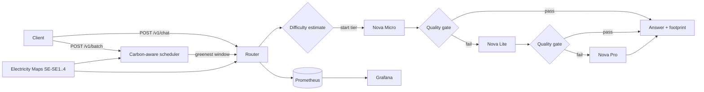

# GreenRoute: carbon-aware router for LLM requests

[](https://github.com/abhinavannareddy/greenroute/actions/workflows/ci.yml)    

GreenRoute sits in front of AWS Bedrock and sends each request to the **smallest model that can answer it**. It escalates to larger models only when an automated quality check fails. Non-urgent **batch jobs are deferred to low-carbon hours** using live Swedish grid carbon-intensity data. Every request is metered for **energy, CO2e and cost**, compared against an always-largest-model baseline, and visualized in Grafana.

**Stack:** Python · FastAPI · AWS Bedrock (Converse API) · Redis · Kubernetes · Prometheus · Grafana



## How it works

**1. Cascade routing** (`app/router.py`). A zero-cost heuristic (`app/complexity.py`) picks the starting tier. It is conservative on purpose: most prompts start at the smallest model, and only clearly heavy ones (code, multi-step reasoning, long inputs) skip ahead. This avoids paying for a small-model attempt that would almost certainly escalate. The router then calls the model. If the quality gate fails, it moves up one tier, until it reaches the largest allowed tier. Model errors such as throttling also trigger escalation, so the cascade doubles as failover.

**2. Quality gate** (`app/quality.py`) runs in two stages:
- *Structural checks* cost nothing. They catch empty answers, answers truncated at `max_tokens`, refusals and hedging, and invalid JSON when `response_format="json"`.
- An *LLM judge* on a small-to-mid tier then scores the answer 1–10 against the request. The answer passes if the score is at or above `QUALITY_THRESHOLD`. The judge is skipped on the last allowed tier, since there is nowhere left to escalate. If the judge's output can't be parsed, the answer fails and the request escalates, so the gate prioritizes quality over savings.

**3. Honest accounting** (`app/accounting.py`). Energy is calculated as `(tokens_in × Wh/1k_in + tokens_out × Wh/1k_out) × PUE`, and CO2e as energy × live grid intensity. Each request's total includes **failed attempts and judge calls**. The baseline is the largest model producing an answer of the same length. The cascade therefore shows up as more expensive than the baseline when it escalates all the way; the tests assert this.

**4. Carbon-aware batch scheduling** (`app/scheduler.py`, `app/carbon.py`). When a job is submitted, GreenRoute fetches the forecast up to the job's deadline and schedules the job at the **earliest slot within 5% of the greenest one**. It doesn't wait hours for marginal gains. A background loop starts a job when its slot arrives, when its deadline is reached, or **early** if live intensity has already dropped to the level it was waiting for. The CO2e avoided is recorded as `energy × (intensity_at_submit − intensity_at_run)`. With Redis, `claim()` is an atomic `SREM`, so each job runs on exactly one replica.

**Carbon data:** Electricity Maps API v3 for Swedish bidding zones `SE-SE1`…`SE-SE4`. If the forecast endpoint isn't on your plan, GreenRoute builds a *persistence forecast* from the last 24 h of history. If the API is down, it reuses the last known value for up to 3 h, then falls back to a synthetic diurnal curve. Every fallback is counted in `greenroute_carbon_fallbacks_total`, so it can't happen silently.

## Quickstart (offline, no AWS needed)

```bash
pip install -r requirements-dev.txt
make test                 # 13 tests
make run                  # mock Bedrock + synthetic grid data, http://localhost:8000/docs
make bench-mock           # routed vs always-largest benchmark
```

Full stack with dashboards:

```bash
docker compose up --build -d
python scripts/loadgen.py --rps 2 --minutes 10
open http://localhost:3000   # admin/admin -> "GreenRoute" dashboard
```

To use real Bedrock and real grid data, copy `.env.example` to `.env`, set `GREENROUTE_MOCK_BEDROCK=false`, set `GREENROUTE_ELECTRICITYMAPS_TOKEN`, and make sure AWS credentials with `deploy/iam-policy.json` are available. You also need model access enabled in the Bedrock console.

## API

```bash
# Routed request
curl -s localhost:8000/v1/chat -H 'content-type: application/json' \
  -d '{"prompt": "What is the capital of Norway?"}'
# -> answer, final model, every attempt with its verdict, footprint, baseline_footprint, savings_pct

# Constrain the cascade or force the baseline (A/B)
-d '{"prompt": "...", "min_tier": 1, "max_tier": 2, "response_format": "json"}'
-d '{"prompt": "...", "baseline": true}'

# Batch job: must start within 12 h; runs in the greenest window before then
curl -s localhost:8000/v1/batch -H 'content-type: application/json' \
  -d '{"requests": [{"prompt": "Summarize ..."}, {"prompt": "Classify ..."}], "deadline_hours": 12}'
curl -s localhost:8000/v1/batch/<job_id>

# Grid status and the greenest upcoming window
curl -s "localhost:8000/v1/carbon?hours=24"
```

## Benchmark

```bash
python -m benchmark.run_benchmark --grader-model <different-family-model-id>
```

This runs every prompt in `benchmark/dataset.jsonl` (24 prompts across factual, transform, summarize, math, reasoning and code) twice: once through the router and once forced onto the largest model. Each answer is graded against a reference by a grader model. Both runs use a single fixed grid intensity, so the comparison isolates the effect of routing. The output is a CSV of every row plus a Markdown table covering accuracy, mean grade, energy, CO2e, cost, p50 latency, escalation rate and model mix.

Use `--grader-model` with a model from a *different family* than your tiers. Otherwise the largest tier grades its own baseline answers, and self-preference bias flatters the baseline.

> Mock-mode numbers only show that the pipeline works; they say nothing about real quality. Run against real Bedrock for results you can quote.

## Dashboard

`deploy/grafana/dashboards/greenroute.json` is generated by `scripts/build_dashboard.py` (dashboard-as-code). It has 18 panels:
- **Per-request stats:** CO2e, energy and cost per request, plus the percentage saved against always-largest for each.
- **Routing:** live grid intensity, final-model mix, escalation rate, and energy, CO2e and cost per request against the baseline over time.
- **Operations:** throughput by model, quality-gate failure rate per model, and p50/p95 latency.
- **Batch:** pending jobs, CO2e avoided by deferral, and deferral hours.

Traffic forced onto the baseline for A/B tests gets `workload="baseline"` and is excluded from the savings panels.

## Deploy to EKS

```bash
docker build -t <ACCOUNT_ID>.dkr.ecr.eu-north-1.amazonaws.com/greenroute:0.1.0 . && docker push ...
# 1. Create an IRSA role with deploy/iam-policy.json and put its ARN in k8s/serviceaccount.yaml
# 2. Set the image in deploy/kustomization.yaml
kubectl apply -k deploy/
kubectl -n greenroute create secret generic greenroute-secrets --from-literal=electricitymaps-token=<TOKEN>
```

The manifests include:
- a Deployment with 2 replicas spread across zones, running non-root with a read-only root filesystem and liveness/readiness probes;
- an HPA (2–10 replicas on CPU), a PodDisruptionBudget, Redis for the job queue, a ServiceMonitor for kube-prometheus-stack, and the dashboard as a ConfigMap labelled `grafana_dashboard: "1"` so the Grafana sidecar picks it up.

## Configuration

All settings are environment variables prefixed with `GREENROUTE_` (see `app/config.py` and `.env.example`). The main ones:

| Variable | Default | Purpose |
|---|---|---|
| `MOCK_BEDROCK` | `false` | Offline mock client |
| `TIERS_FILE` | built-in | Model IDs, prices and energy coefficients (`config/tiers.yaml`) |
| `JUDGE_TIER` / `QUALITY_THRESHOLD` | `1` / `7` | Which tier judges, and the pass score |
| `CARBON_ZONE` | `SE-SE3` | Swedish bidding zone |
| `PUE` | `1.15` | Data-centre overhead multiplier |
| `WINDOW_TOLERANCE` | `0.05` | Accept a slot within 5% of the greenest one |
| `REDIS_URL` | unset | Required when running more than one replica |

## Limitations and design notes

- **Energy figures are estimates.** Bedrock doesn't expose energy use, so per-token coefficients stand in for measurements. Calibrate them in `config/tiers.yaml`. The *relative* savings between tiers are much more robust than the absolute Wh.
- **Where inference actually runs.** `eu.` model IDs are cross-region inference profiles, so AWS may serve a request from another EU region. For strict accounting, use in-region model IDs where available, or map the serving region to its own grid zone.
- **The Swedish grid is already clean** (typically tens of gCO2e/kWh), so the savings from deferral are small in absolute grams but real in relative terms. The largest daily swings are in SE4. The scheduler is zone-agnostic: point `CARBON_ZONE` at, for example, `DE` or `PL` to see much larger effects.
- **The cascade has overhead.** A request that escalates to the top tier costs more than going straight there. Net savings depend on keeping the escalation rate low, which the dashboard tracks. The difficulty estimator exists to reduce this overhead.
- **Deadlines are "latest start" times,** not completion times. Size `deadline_hours` accordingly for long jobs.

## Project layout

```
app/          FastAPI app, router, quality gate, carbon providers, scheduler, metrics
benchmark/    dataset + routed-vs-baseline benchmark
config/       model tiers (IDs, prices, energy coefficients)
deploy/       k8s manifests (kustomize), Grafana dashboard + provisioning, Prometheus, IAM
scripts/      load generator, dashboard generator
tests/        router, quality gate, scheduler tests
```
